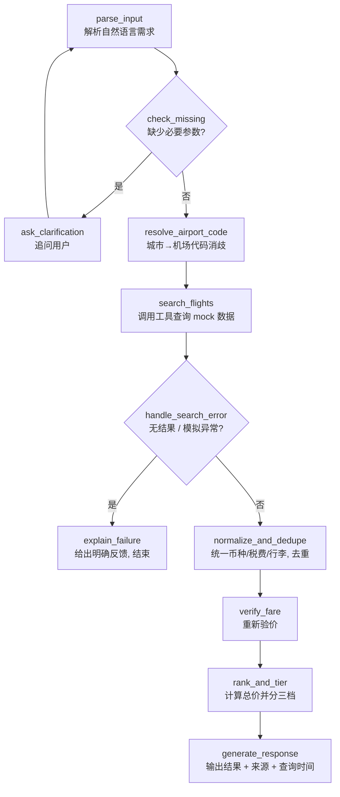

# 机票比价 Agent（Flight Price Compare Agent）

用自然语言描述一次出行需求，Agent 自动补全缺失信息、调用航班搜索工具、用确定性代码完成价格计算与排序，最终给出「最便宜 / 综合最优 / 最舒适」三档结果，并标注数据来源与查询时间。

> **项目状态**：需求分析与技术方案已定稿（见 [docs/requirements.md](docs/requirements.md)），代码实现进行中。下面的「快速开始」描述的是设计目标的运行方式，评测数字会在跑通评测集后由真实结果替换，不做预先编造。

## 这个项目在解决什么问题

“帮我找 9 月从上海去东京、玩 5 天、带 20kg 托运行李、不要红眼航班的机票”——这类需求包含多个隐含约束（日期范围、行李费、中转红眼判断），直接丢给通用搜索引擎很难一次拿到准确结果。这个项目用 LLM 负责“理解需求 + 调用工具 + 解释结果”，用普通代码负责“价格计算、币种换算、去重、排序”这类必须保证正确性的部分，两者边界清晰、互不越界。

## 核心特性

- **自然语言解析**：提取出发地、目的地、日期、行李、偏好等结构化字段；关键信息缺失时不猜测，主动追问用户。
- **LangGraph 工作流编排**：多节点图，包含条件分支、追问循环、工具调用、错误处理分支，而非一次性 Prompt 硬出结果。
- **确定性业务逻辑**：总价计算、币种/税费/行李标准化、去重、重新验价均由普通代码完成，不依赖 LLM 生成数字。
- **三档结果**：最便宜 / 综合最优 / 最舒适，每条结果标注数据来源与查询时间。
- **面向 MCP 的工具设计**：`search_flights` 等工具遵循 MCP tool schema 风格定义，并提供一个最小 MCP Server 封装，便于后续独立拆分。
- **服务化**：FastAPI 提供 `/query` HTTP 接口，自带 Swagger UI，可直接在浏览器里发起请求做演示。
- **可验证的质量**：pytest 覆盖价格计算、去重、排序等确定性逻辑；固定的 10 场景评测集给出真实的参数提取正确率、任务完成率、响应时间与 Token 成本。

## 系统架构



LLM 负责的节点：`parse_input`、`ask_clarification`、`generate_response` 的自然语言表达。
普通代码负责的节点：`resolve_airport_code`（查表）、`normalize_and_dedupe`、`verify_fare`、`rank_and_tier`（价格/排序均为确定性计算，不允许 LLM 生成数字）。

完整的节点说明、状态定义和设计取舍见 [docs/requirements.md](docs/requirements.md)。

## 技术栈

| 层级 | 选择 | 说明 |
|---|---|---|
| 语言 | Python 3.11+ | |
| Agent 编排 | LangGraph | 多节点图，条件边 + 循环边 |
| LLM 接入 | OpenAI-compatible API | 不锁定厂商，通过 `base_url` / `api_key` / `model` 配置切换 |
| 数据校验 | Pydantic | 结构化输出与工具入参/出参校验 |
| Web 服务 | FastAPI | 单一 `/query` 端点 + 自带 Swagger UI |
| 工具协议 | MCP-style schema + 最小 MCP Server | 便于后续独立拆分为 MCP 项目 |
| 测试 | pytest | 覆盖确定性业务逻辑 |
| 数据源 | 本地 mock 数据（`data/mock_flights.json`） | 当前阶段不接入真实机票 API |

## 快速开始（设计目标，将随开发进度验证为真实命令）

```bash
git clone <repo-url>
cd flight-price-compare

# 安装依赖
uv sync   # 或 pip install -r requirements.txt

# 配置环境变量
cp .env.example .env
# 编辑 .env，填入 LLM_API_KEY / LLM_BASE_URL / LLM_MODEL

# 启动服务
uvicorn src.app:app --reload

# 打开 Swagger UI 体验
# http://127.0.0.1:8000/docs
```

发起一次查询：

```bash
curl -X POST http://127.0.0.1:8000/query \
  -H "Content-Type: application/json" \
  -d '{"message": "帮我看看9月从上海去东京，玩5天，带一个20kg托运行李，不要红眼航班"}'
```

示例响应结构（字段示意，非真实返回）：

```json
{
  "status": "ok",
  "missing_fields": [],
  "results": {
    "cheapest": { "total_price_cny": 0, "source": "mock", "queried_at": "" },
    "best_overall": { "total_price_cny": 0, "source": "mock", "queried_at": "" },
    "most_comfortable": { "total_price_cny": 0, "source": "mock", "queried_at": "" }
  }
}
```

单独运行最小 MCP Server：

```bash
python -m src.mcp_server
```

## 项目结构

```text
flight-price-compare/
├── README.md
├── docs/
│   ├── requirements.md      # 完整需求分析
│   └── resume-guide.md      # 简历与面试话术准备
├── src/                      # Agent、工具、FastAPI、MCP Server 实现
├── tests/                     # pytest 单元测试
├── data/
│   └── mock_flights.json     # 模拟航班数据
├── eval/                      # 评测脚本与场景定义
└── .env.example
```

## 已知限制

- 当前数据源为本地 mock 数据，未接入真实机票供应商 API。
- MCP 封装为最小可用版本（单工具），未按独立项目标准补全测试与文档。
- 暂无用户偏好记忆（Memory），无持久化存储。
- 评测集为 10 个固定场景，不覆盖多数据源并发失败、限流等生产场景。

完整的验收标准、评测方法与限制说明见 [docs/requirements.md](docs/requirements.md)。

## Roadmap

- 接入真实/沙箱机票 API，支持多数据源并行搜索与部分失败容错。
- 将 MCP 封装升级为独立完整项目：细化工具集、结构化错误、测试与文档。
- 增加用户偏好记忆（常用出发城市、行李、航司、币种），需用户明确确认。
- 引入结构化日志 / LangSmith 等 Tracing 方案，补充 P95 响应时间与失败恢复成功率。
- 提供 Web 前端或 Streamlit 演示页与在线部署地址。

## 学习路径背景

本项目脱胎于一份更完整的 12 周 Agent 学习计划（见 [agent-learning-project-plan.md](agent-learning-project-plan.md)）。当前版本是在已具备基础前置知识的前提下，将其压缩为一天冲刺完成的最小可展示版本，聚焦点从「系统学习」转为「快速产出一个可讲清楚设计取舍的简历项目」。

---

## English Summary

An LLM agent that turns a natural-language flight request (origin, destination, dates, baggage, preferences) into a structured search, asks for missing required fields instead of guessing, calls a `search_flights` tool over mock flight data via a LangGraph workflow (with conditional branches, a clarification loop, and an error-handling branch), and hands price calculation, currency/baggage normalization, deduplication, and fare re-verification to deterministic code rather than the LLM. Tools are designed MCP-schema-compatible and wrapped in a minimal MCP server. Served over FastAPI with a `/query` endpoint and Swagger UI, with pytest coverage on the deterministic logic and a fixed 10-scenario evaluation set reporting real parameter-extraction accuracy, tool-call success rate, end-to-end task completion rate, average latency, and token cost. See [docs/requirements.md](docs/requirements.md) for the full spec and [docs/resume-guide.md](docs/resume-guide.md) for how this project is framed on a resume.
