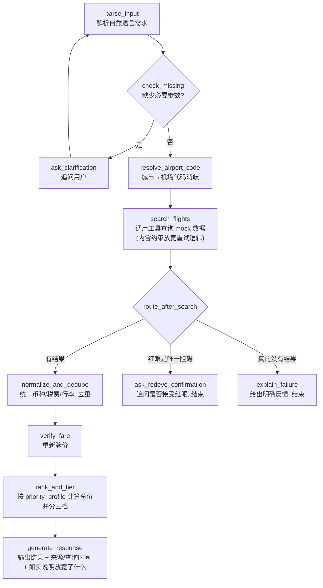

# 机票比价 Agent（Flight Price Compare Agent）

用自然语言描述一次出行需求，Agent 自动补全缺失信息、调用航班搜索工具、用确定性代码完成价格计算与排序，最终给出「最便宜 / 综合最优 / 最舒适」三档结果，并标注数据来源与查询时间。

> **项目状态**：代码已实现、测试已跑通、评测已完成。`pytest`（43 个用例）全部通过；29 场景评测集在 `deepseek-flash` 上实测参数提取正确率 100%、工具调用成功率 100%、端到端任务完成率 100%，平均响应时间约 4.5s，平均 Token 成本约 1030 tokens/请求（详见 `eval/results.md`，测量于 2026-09-14）。项目经历过一次"这算不算真正的 Agent"的自我审视：最初的版本里 LLM 从不自主决定调用哪个工具、什么时候重试，只是在固定节点上做结构化抽取和生成文案。调研了 LangGraph 官方客服机器人教程和 CRAG（Corrective RAG）等参考实现后，加上了两个真正需要语义判断的决策点——**结果不够好时按规则自主放宽日期窗口重试，但不会擅自放弃用户明确说过的红眼限制，只会先问一句**；以及**按用户表达的价格/舒适度倾向选择不同的排序权重**——过程中又踩出两个真实 bug（用户拒绝放宽红眼后系统会不停追问同一个问题；"一周弹性"被 LLM 误判成"玩一周"）。完整的踩坑记录见 [docs/resume-guide.md](docs/resume-guide.md)。

## 这个项目在解决什么问题

“帮我找 9 月从上海去东京、玩 5 天、带 20kg 托运行李、不要红眼航班的机票”——这类需求包含多个隐含约束（日期范围、行李费、中转红眼判断），直接丢给通用搜索引擎很难一次拿到准确结果。这个项目用 LLM 负责“理解需求 + 调用工具 + 解释结果”，用普通代码负责“价格计算、币种换算、去重、排序”这类必须保证正确性的部分，两者边界清晰、互不越界。

## 核心特性

- **自然语言解析**：提取出发地、目的地、日期、行李、偏好等结构化字段；关键信息缺失时不猜测，主动追问用户。
- **LangGraph 工作流编排**：多节点图，包含条件分支、追问循环、工具调用、错误处理分支，而非一次性 Prompt 硬出结果。
- **约束放宽重试（参考 CRAG 设计）**：查询没结果时，系统按规则自主放宽"用户没明确要求过"的日期弹性再试一次；但"不要红眼航班"这种用户明确表达的硬约束，不会被自主放弃，只会生成一句追问，等用户下一轮确认才放宽——放宽了什么都会在回复里如实告知，不会假装是精确查到的。
- **按偏好选排序策略**：LLM 从用户话里判断更看重价格还是舒适度，映射成价格优先/舒适优先/均衡三种预设权重之一；LLM 只挑枚举值，具体计算仍是确定性代码。
- **确定性业务逻辑**：总价计算、币种/税费/行李标准化、去重、重新验价均由普通代码完成，不依赖 LLM 生成数字。
- **三档结果**：最便宜 / 综合最优 / 最舒适，每条结果标注数据来源与查询时间。
- **面向 MCP 的工具设计**：`search_flights` 等工具遵循 MCP tool schema 风格定义，并提供一个最小 MCP Server 封装，便于后续独立拆分。
- **服务化**：FastAPI 提供 `/query` HTTP 接口，自带 Swagger UI，可直接在浏览器里发起请求做演示。
- **可验证的质量**：pytest 覆盖价格计算、去重、排序等确定性逻辑；固定的 29 场景评测集不仅检查状态码，还校验实际选中的航班/错误原因是否正确，给出真实的参数提取正确率、任务完成率、响应时间与 Token 成本。

## 系统架构



LLM 负责的节点：`parse_input`（含判断 `priority_profile`）、`ask_clarification`、`ask_redeye_confirmation`、`generate_response` 的自然语言表达。
普通代码负责的节点：`resolve_airport_code`（查表）、`search_flights` 内的约束放宽/重试判断（规则驱动，参考真实 CRAG 实现——要不要重试通常也是规则/阈值判断，不是让 LLM 决定控制流）、`normalize_and_dedupe`、`verify_fare`、`rank_and_tier`（价格/排序均为确定性计算，`priority_profile` 只影响用哪套权重，权重本身和计算都不允许 LLM 参与）。

完整的节点说明、状态定义和设计取舍见 [docs/requirements.md](docs/requirements.md)。

## 技术栈

| 层级 | 选择 | 说明 |
|---|---|---|
| 语言 | Python 3.11+ | |
| Agent 编排 | LangGraph | 多节点图，条件边 + 循环边 |
| LLM 接入 | OpenAI-compatible API | 不锁定厂商，通过 `base_url` / `api_key` / `model` 配置切换 |
| 数据校验 | Pydantic | 结构化输出与工具入参/出参校验 |
| Web 服务 | FastAPI | 单一 `/query` 端点 + 自带 Swagger UI |
| 工具协议 | MCP-style schema + 最小 MCP Server | 便于后续独立拆分为 MCP 项目 |
| 测试 | pytest | 覆盖确定性业务逻辑 |
| 数据源 | 本地 mock 数据（`data/mock_flights.json`） | 当前阶段不接入真实机票 API |

## 快速开始

```bash
git clone <repo-url>
cd flight-price-compare

# 安装依赖（任选其一）
pip install -r requirements.txt
# 或者用 conda/venv 创建好环境后再 pip install -r requirements.txt

# 配置环境变量
cp .env.example .env
# 编辑 .env，填入 LLM_API_KEY / LLM_BASE_URL / LLM_MODEL

# 启动服务
uvicorn src.app:app --reload

# 打开 Swagger UI 体验
# http://127.0.0.1:8000/docs
```

发起一次查询：

```bash
curl -X POST http://127.0.0.1:8000/query \
  -H "Content-Type: application/json" \
  -d '{"message": "帮我看看9月从上海去东京，玩5天，带一个20kg托运行李，不要红眼航班"}'
```

响应结构示例（字段结构真实，具体数值取决于你配置的模型和请求参数；`status` 会是 `results`/`clarification`/`error` 三者之一）。单程查询只有 `outbound`，往返查询（`trip_duration_days` 有值）会同时带上 `return` 和合计的 `total_price_cny`；如果搜索时自动放宽过日期窗口，`relaxation_notes` 会记录放宽了什么：

```json
{
  "status": "results",
  "message": "已为你找到 3 档结果，均来自 mock 数据源...",
  "missing_fields": [],
  "pending_confirmation": null,
  "relaxation_notes": [],
  "results": {
    "cheapest": {
      "tier": "cheapest",
      "outbound": { "flight_id": "NH920", "airline": "NH", "departure_time": "2026-09-10T09:00:00+09:00", "arrival_time": "2026-09-10T11:30:00+09:00", "is_red_eye": false, "total_price_cny": 1800.0, "source": "mock_b", "queried_at": "2026-09-14T08:00:00+00:00" },
      "return": { "flight_id": "NH921", "total_price_cny": 1656.0, "source": "mock_b", "queried_at": "2026-09-14T08:00:00+00:00" },
      "total_price_cny": 3456.0
    },
    "best_overall": { "tier": "best_overall", "outbound": { "...": "结构同上" } },
    "most_comfortable": { "tier": "most_comfortable", "outbound": { "...": "结构同上" } }
  }
}
```

如果查询触发了"只有红眼航班"这种需要用户确认才能放宽的情况，`status` 会是 `clarification`，`results` 为空，`pending_confirmation` 会带上 `{"type": "redeye"}`——**客户端必须在下一次 `/query` 请求里把这个值原样传回 `pending_confirmation` 字段**，系统才能正确理解用户下一句话是在回答这个确认问题，而不是一次全新的查询。

单独运行最小 MCP Server：

```bash
python -m src.mcp_server
```

## 本地演示（Streamlit）

一个对话式的本地演示页，用来现场演示和录 GIF，不做在线部署。它只是 `/query` 的一个客户端，
所有对话状态仍由页面自己在多轮请求间原样回传（服务端无状态的设计没有变），不需要改动后端代码。

```bash
# 先在一个终端启动后端
uvicorn src.app:app --reload

# 再另开一个终端，安装演示专用依赖并启动
pip install -r requirements-demo.txt
streamlit run demo/streamlit_app.py
```

## 运行测试与评测

```bash
# 确定性逻辑的单元测试（不需要 LLM Key，43 个用例全部通过）
pytest -q

# 端到端评测集（需要先配置好 .env 里的真实 LLM_API_KEY）
python -m eval.run_eval
```

`pytest` 覆盖价格计算、币种换算、去重、验价、红眼过滤、往返回程搜索、约束放宽/重试规则等确定性逻辑，随时可以在没有网络/API Key 的情况下运行（其中涉及 LLM 调用的合并逻辑用 mock 掉 `chat_json`/`chat_text` 来测，同样不需要真实 API Key）。`eval/run_eval.py` 会跑 29 个固定场景并把参数提取正确率、工具调用成功率、端到端任务完成率、平均响应时间与平均 Token 成本写入 `eval/results.md`——这一步需要真实的 LLM 调用，数字必须由你自己跑出来。

## 项目结构

```text
flight-price-compare/
├── README.md
├── docs/
│   ├── requirements.md      # 完整需求分析
│   └── resume-guide.md      # 简历与面试话术准备
├── src/                      # Agent、工具、FastAPI、MCP Server 实现
├── demo/
│   └── streamlit_app.py      # 本地演示页（对话式调用 /query，不做在线部署）
├── tests/                     # pytest 单元测试
├── data/
│   └── mock_flights.json     # 模拟航班数据
├── eval/                      # 评测脚本与场景定义
├── requirements-demo.txt      # 演示页专用依赖（streamlit / requests）
└── .env.example
```

## 已知限制

- 当前数据源为本地 mock 数据，未接入真实机票供应商 API。
- MCP 封装为最小可用版本（单工具），未按独立项目标准补全测试与文档。
- 暂无用户偏好记忆（Memory），无持久化存储。
- 评测集为 29 个固定场景，不覆盖多数据源并发失败、限流等生产场景。
- 状态合并无法显式"清空"一个已知字段（比如先说往返、后说不用回程了，行程天数不会被清空），详见 `docs/requirements.md` 第 14 节。
- 往返定价按"去程回程各自独立分档、同档位配对求和"计算，不做全组合最优搜索。
- 约束放宽重试只覆盖"日期"和"红眼"两个会真正导致零结果的维度（行李在当前实现里只影响计费，不影响搜索结果有没有，所以不用放宽）；红眼限制一旦被用户明确拒绝放宽，本次会话就不会再问第二次。
- 没有"关键操作前需要用户确认"这个环节——不是漏了，是因为当前项目只做搜索/比价推荐，不涉及预定、改签、扣款这类不可逆操作，没有东西需要确认；详见 Roadmap。

完整的验收标准、评测方法与限制说明见 [docs/requirements.md](docs/requirements.md)。

## Roadmap

- 接入真实/沙箱机票 API，支持多数据源并行搜索与部分失败容错。
- 将 MCP 封装升级为独立完整项目：细化工具集、结构化错误、测试与文档。
- 增加用户偏好记忆（常用出发城市、行李、航司、币种），需用户明确确认。
- 引入结构化日志 / LangSmith 等 Tracing 方案，补充 P95 响应时间与失败恢复成功率。
- 在线部署地址（目前只有本地 Streamlit 演示页，见「本地演示」一节，不做长期在线托管）。
- **预定模块（如果做）需要 human-in-the-loop 确认环节**：参考 LangGraph 官方客服机器人教程的设计——占座、扣款这类不可逆操作执行前，必须用 `interrupt()` 之类的机制暂停、等用户明确点头再继续。当前项目没有这个环节不是遗漏，而是现在只做比价推荐、没有任何不可逆操作需要确认；一旦引入预定，这里就是必须补上确认环节的地方。

## 学习路径背景

本项目脱胎于一份更完整的 12 周 Agent 学习计划（见 [agent-learning-project-plan.md](agent-learning-project-plan.md)）。当前版本是在已具备基础前置知识的前提下，将其压缩为一天冲刺完成的最小可展示版本，聚焦点从「系统学习」转为「快速产出一个可讲清楚设计取舍的简历项目」。

---

## English Summary

An LLM agent that turns a natural-language flight request (origin, destination, dates, baggage, preferences) into a structured search, asks for missing required fields instead of guessing, and calls a `search_flights` tool over mock flight data via a LangGraph workflow (conditional branches, a clarification loop, and an error-handling branch). Two design decisions make this a genuine agent rather than a disguised deterministic pipeline, both arrived at after researching LangGraph's official customer-support-bot tutorial and the CRAG (Corrective RAG) pattern: (1) when a search comes back empty, the system rule-based-ly retries by widening an *unstated* date-flexibility window, but will never silently drop a constraint the user explicitly stated (e.g. "no red-eyes") — it asks permission first, and won't ask twice if declined; (2) a `priority_profile` inferred from the user's stated price/comfort trade-off (not a fixed formula) selects which of three preset weightings the deterministic ranker uses for "best overall." Price calculation, currency/baggage normalization, deduplication, and fare re-verification remain deterministic code throughout — the LLM never touches a number. Tools are MCP-schema-compatible and wrapped in a minimal MCP server. Served over FastAPI with a `/query` endpoint and Swagger UI, with 43 pytest cases on the deterministic logic and a fixed 29-scenario evaluation set (including phrasing inspired by the classic ATIS dialogue dataset) reporting real parameter-extraction accuracy, tool-call success rate, end-to-end task completion rate, average latency, and token cost — all currently 100% on the correctness metrics, reached only after finding and fixing several real bugs along the way (documented honestly, not smoothed over). See [docs/requirements.md](docs/requirements.md) for the full spec and [docs/resume-guide.md](docs/resume-guide.md) for how this project is framed on a resume.
