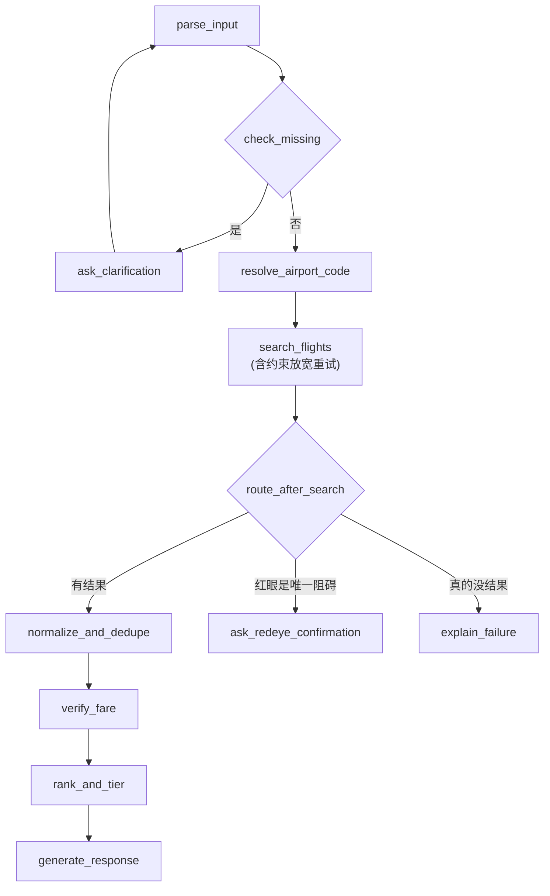

# 需求分析：机票比价 Agent（一天冲刺版）

本文档是本项目当前阶段的完整规格说明，写在动手编码之前，目的是让实现阶段可以直接对照，而不是边写边设计。范围已经从原始的 12 周学习计划（见 [../agent-learning-project-plan.md](../agent-learning-project-plan.md)）压缩为「已具备前置知识、一天内完成一个可讲清楚设计取舍的最小可展示版本」。

## 1. 背景与目标

- 背景：原计划是一个 12 周的系统学习 + 项目路线，覆盖结构化输出、工具调用、Agent 框架、MCP、评测与生产可靠性。
- 当前调整：前置知识已基本学过（不熟练但都接触过），不再按周程学习，改为一天内产出一个**范围明确、指标真实**的最小可展示项目，同时尽量在这一天内触达六个学习方向：API/结构化输出、Tool Calling、Agent Loop、LangGraph、MCP、Eval。
- 目标：
  1. 产出一个能跑通的机票比价 Agent（LangGraph 编排 + FastAPI 服务）。
  2. 用真实跑分（而非编造数字）支撑简历表述。
  3. 项目复杂度控制在一天可控范围内：单一 mock 数据源、10 节点图、10 场景评测集、最小 MCP 封装。

## 2. 范围定义

### 2.1 本次做（In Scope）

- 自然语言需求解析为结构化字段，缺失关键字段时追问。
- 基于 LangGraph 的多节点工作流（含条件分支、循环、错误处理分支）。
- 基于本地 mock 数据的航班搜索工具。
- 确定性的价格计算、币种/税费/行李标准化、去重、重新验价、排序分档。
- `search_flights` 等工具的 MCP-style schema 设计，并提供一个最小 MCP Server 封装（单工具）。
- FastAPI `/query` 接口 + Swagger UI。
- pytest 覆盖确定性逻辑。
- 10 场景固定评测集，测量 4 项真实指标。

### 2.2 本次不做（Out of Scope，写入 README Roadmap）

- 真实/沙箱机票 API 接入、多数据源并行搜索与部分失败容错（原计划 Stage 4）。
- 完整独立的 MCP Server 项目（细化多工具、完整测试与文档，原计划 Stage 5）。
- 用户偏好记忆 / RAG（原计划 Stage 6）。
- P95 响应时间、失败恢复成功率等需要更大样本量才有统计意义的指标。
- Web 前端 / Streamlit 演示页、在线部署。
- 多语言 i18n、认证鉴权、限流等生产级基础设施。

## 3. 目标用户场景

主场景（沿用原计划）：

> 查找 9 月从上海去东京、旅行 5 天、含 20kg 行李、避免红眼航班的综合最优机票。

其余场景由第 8 节的评测集覆盖（缺参数、模糊日期、错误机场代码、无结果、中途改需求等）。

## 4. 功能需求

对应架构图（见第 7 节）各节点：

| 编号 | 需求 | 对应节点 |
|---|---|---|
| F1 | 从自然语言中提取出发地、目的地、日期、行程天数、日期弹性、行李重量、是否避免红眼等字段 | `parse_input` |
| F2 | 缺失必要字段（出发地/目的地/日期三者之一）时不得猜测，必须追问 | `check_missing` / `ask_clarification` |
| F3 | 用户补充信息后能与已解析结果合并，重新进入解析流程 | `ask_clarification` → `parse_input` |
| F4 | 模糊城市名解析为机场代码；无法识别的机场代码需返回明确错误 | `resolve_airport_code` |
| F5 | 调用 `search_flights` 工具从 mock 数据中查询候选航班 | `search_flights` |
| F6 | 无结果或模拟工具异常时，返回清晰、可读的失败原因，而不是空结果或崩溃 | `handle_search_error` / `explain_failure` |
| F7 | 统一候选航班的币种、税费、行李费字段 | `normalize_and_dedupe` |
| F8 | 对同一行程的重复报价去重 | `normalize_and_dedupe` |
| F9 | 展示结果前重新验价（模拟“报价可能过期”场景） | `verify_fare` |
| F10 | 计算含行李费的总价，并输出最便宜 / 综合最优 / 最舒适三档结果 | `rank_and_tier` |
| F11 | 每条结果标注数据来源与查询时间 | `generate_response` |
| F12 | 用户中途修改条件（如临时更换目的地）时，Agent 能识别变化并重新处理，而不是叠加冲突条件 | `parse_input`（增量合并逻辑） |
| F13 | 用户提出往返需求（说明了行程天数或明确的返程日期）时，真正搜索并计价回程航班，而不只是解析出字段却不使用 | `search_flights`（回程日期由出发日期+行程天数推算）、`rank_and_tier` |
| F14 | 搜索无结果时，若用户从没明确表态过日期弹性，按规则自主放宽日期窗口重试一次；若用户明确表态过弹性范围，不允许自主超出 | `search_flights`（`_search_leg_with_relaxation`） |
| F15 | 放宽日期后如果依然无结果，且"不要红眼航班"是唯一的阻碍，不允许自主放弃这条用户明确表达的硬约束，必须先追问用户是否愿意接受，得到同意后才重新搜索；用户拒绝后本次会话不再重复追问同一个问题 | `search_flights`（探测 `redeye_blocking`）、`ask_redeye_confirmation` |
| F16 | 从用户的自然语言里判断价格/舒适度倾向，归类为价格优先/舒适优先/均衡三种预设策略之一，作为"综合最优"档的排序权重依据 | `parse_input`（判断 `priority_profile`）、`rank_and_tier`（按权重计算，权重和计算过程均为确定性代码） |
| F17 | 无论是否发生了约束放宽，最终回复必须如实告知用户做了什么调整（比如放宽了几天日期），不能假装是按用户原话精确查到的 | `generate_response` |

## 5. 非功能需求

- **正确性优先于智能**：价格计算、排序、去重、币种换算一律由普通代码实现，不允许 LLM 生成或“估算”数字。
- **可观测**：每次请求记录耗时、Token 用量、是否命中追问分支、是否命中错误分支，供评测脚本统计。
- **可配置**：LLM Provider（`base_url` / `api_key` / `model`）必须可通过环境变量切换，不硬编码厂商 SDK 特有逻辑。
- **可测试**：确定性逻辑必须是无外部依赖的纯函数，便于 pytest 直接测试。
- **诚实**：所有对外指标（简历、README）必须来自评测脚本的真实输出，未测量的指标不得出现具体数字，只能写“待测量”或省略。
- **自主权边界**：Agent 可以自主放宽用户没有明确表态过的默认值（比如没提过弹性天数的日期窗口），但不能不打招呼就推翻用户明确表达过的约束（比如"不要红眼航班"）——这条原则和"必要字段不允许模型猜测"是同一类问题的两个方面：模型不该替用户做主，无论是在信息不足时瞎猜，还是在用户已经表过态之后擅自改主意。详见第 7.1 节的完整分析。

## 6. 数据模型

### 6.1 用户需求（Agent 内部状态的一部分）

```json
{
  "origin": "SHA",
  "destination": "TYO",
  "departure_date": null,
  "trip_duration_days": 5,
  "date_flexibility_days": 2,
  "date_flexibility_explicit": true,
  "checked_baggage_kg": 20,
  "avoid_red_eye": true,
  "redeye_confirmation_declined": false,
  "priority_profile": "BALANCED",
  "missing_fields": ["departure_date"]
}
```

- 缺失字段用 `null`，并显式列在 `missing_fields` 中，禁止模型猜测填充。
- 城市名与机场代码需能互相映射（如 `上海` → `SHA`，覆盖多机场城市如 `SHA`/`PVG`）。
- `date_flexibility_explicit`：用户是否明确说过弹性天数（哪怕是 0）。区分"从没提过"（可以被自主放宽）
  和"明确说过"（不能被自主超出）的关键字段，由代码根据本轮 LLM 输出是否包含该字段来判断和维护，
  不是让 LLM 直接输出这个布尔值。
- `redeye_confirmation_declined`：是否已经问过"要不要接受红眼"且被拒绝过，避免重复追问同一个问题；
  同样由代码维护，依据是"问过 + 用户回复后 avoid_red_eye 有没有变成 false"来推断，不额外让 LLM 输出。
- `priority_profile`：`PRICE_FIRST` / `COMFORT_FIRST` / `BALANCED` 之一，由 LLM 从自然语言判断后输出。

### 6.2 航班报价（mock 数据 / 工具返回）

```json
{
  "flight_id": "MU5042-2026-09-10",
  "origin": "SHA",
  "destination": "NRT",
  "departure_time": "2026-09-10T23:55:00+08:00",
  "arrival_time": "2026-09-11T04:10:00+09:00",
  "is_red_eye": true,
  "airline": "MU",
  "base_price": 1580,
  "currency": "CNY",
  "baggage_fee_per_20kg": 200,
  "tax_and_fees": 120,
  "source": "mock",
  "queried_at": "2026-09-13T10:00:00+08:00"
}
```

### 6.3 输出结果

```json
{
  "tier": "cheapest",
  "outbound": {
    "flight_id": "MU5042-2026-09-10",
    "total_price_cny": 1900,
    "breakdown": { "base_price": 1580, "baggage_fee": 200, "tax_and_fees": 120 },
    "source": "mock",
    "queried_at": "2026-09-13T10:00:00+08:00"
  },
  "total_price_cny": 1900
}
```

往返查询时每个档位会多一个 `return` 字段（结构同 `outbound`），`total_price_cny` 是去程 + 回程的合计。

响应顶层还有两个字段配合约束放宽/确认机制：
- `relaxation_notes`：本次搜索自动放宽了哪些"用户没明确表态过"的约束（目前只有日期弹性），空数组表示没有放宽。
- `pending_confirmation`：当前是否在等用户确认某个硬约束要不要放宽（目前只有 `{"type": "redeye"}` 一种），
  客户端必须在下一次请求里原样带回来，系统才能正确解读用户的回复。

mock 数据集需要覆盖：至少两个目的城市（含多机场城市，如东京 NRT/HND）、正常航班与红眼航班、正常价格与无结果的日期区间、一个刻意设置的“无效机场代码”用例、一个"该日期只有红眼航班可选"的用例（用于测试约束放宽的确认流程）。

## 7. 系统架构与工作流（LangGraph）



节点职责与决策归属：

| 节点 | 职责 | LLM 还是普通代码 |
|---|---|---|
| `parse_input` | 自然语言 → 结构化需求（含 `priority_profile` 判断，Pydantic 校验，失败重试） | LLM（结构化输出） |
| `check_missing` | 判断必要字段是否齐全 | 普通代码（条件边） |
| `ask_clarification` | 生成追问文案，合并用户新回答 | LLM 生成文案 + 代码合并状态 |
| `resolve_airport_code` | 城市名 → 机场代码，多机场消歧 | 普通代码（查表） |
| `search_flights` | 调用工具查询 mock 数据；无结果时按规则判断能不能自主放宽日期、要不要探测红眼是否是唯一阻碍 | 普通代码（规则驱动，见 7.1 节） |
| `route_after_search` | 三选一：有结果 / 红眼阻碍需要确认 / 真的没结果 | 普通代码（条件边） |
| `ask_redeye_confirmation` | 生成追问文案，询问是否接受红眼航班 | LLM 生成文案 |
| `explain_failure` | 生成清晰的失败说明 | LLM 生成文案 |
| `normalize_and_dedupe` | 统一币种/税费/行李字段，去重 | 普通代码 |
| `verify_fare` | 重新验价（模拟报价过期判断） | 普通代码 |
| `rank_and_tier` | 按 `priority_profile` 对应的权重计算总价、排序、分三档 | 普通代码（权重表是写死的，LLM 只提供 profile 标签） |
| `generate_response` | 组织最终自然语言 + 结构化结果，如实说明放宽了什么 | LLM 生成文案 + 代码提供数据 |

这个划分本身是一个重要的面试讲解点：哪些环节必须让 LLM 做判断（理解自然语言、生成追问/解释文案、归类用户倾向），哪些环节绝不能让 LLM 参与（任何涉及金额、排序、去重的计算，以及"要不要重试/放宽约束"这个控制流决策本身）。

> **实现说明**：`avoid_red_eye` 是用户明确表达的硬约束（"不要红眼航班"），不是一个仅影响排序权重的软偏好。因此在 `search_flights` 节点里就会把红眼航班直接过滤掉，而不是留到 `rank_and_tier` 只做轻微降权——否则一趟很便宜的红眼航班仍可能被判定为"最便宜/综合最优"，与用户的明确要求矛盾。这是编码阶段发现并修正的一处设计细节，对应评测场景 10 的验证点。

### 7.1 是否需要 Agent：一次真实的设计审视

这个项目最初的版本里，LLM 从不自主决定"要不要调用工具、调用哪个"——那一步完全是代码按 `missing_fields` 之类的条件写死的，LLM 只在固定节点上做结构化抽取和生成文案。这更准确地说是"LLM 辅助的确定性工作流"，不是严格意义上会自主决策的 Agent，这一点在项目中期被主动提出并分析过，结论和依据如下：

**分析方法**：调研了 GitHub 上高星的相关参考实现——[langchain-ai/langgraph](https://github.com/langchain-ai/langgraph) 官方仓库的 "Build a Customer Support Bot" 教程（一个瑞士航空客服/订票助手，展示了"关键操作前需要用户确认"和多助手移交模式）、[langchain-ai/react-agent](https://github.com/langchain-ai/react-agent)（标准 ReAct 模板），以及 CRAG（Corrective RAG，见 [langgraph_crag.ipynb](https://github.com/langchain-ai/langgraph/blob/main/examples/rag/langgraph_crag.ipynb) 和 [Self-Reflective RAG 博客](https://www.langchain.com/blog/agentic-rag-with-langgraph)）这个"评估结果质量不够好就改写查询重试"的设计模式。

**结论：部分适合，边界画得很具体**

| 候选方向 | 结论 | 理由 |
|---|---|---|
| CRAG 式的约束放宽重试 | **采纳**（F14/F15） | 比价场景经常"条件太严导致无结果"，"该放宽哪个"是真实存在的语义判断，不违反"排序/计算必须是确定性代码"的原则 |
| 客服机器人式的 human-in-the-loop 确认 | **现在不采纳** | 原教程需要确认是因为会执行改签/取消/扣款这类不可逆操作；本项目只做搜索比价，没有任何不可逆操作需要确认，硬套这个模式就是"为了像 agent 而 agent"。已写入 README Roadmap：预定模块一旦立项，这里就是要补上确认环节的地方 |
| 按用户偏好选排序策略 | **采纳**（F16） | "综合最优"原本是写死的固定公式，不管用户怎么表达都用同一套权重；让 LLM 判断倾向、代码执行计算，是一个真实存在但之前没做的语义判断点 |
| 追问超过 N 轮后用默认值兜底继续搜索 | **主动否决，未采纳** | 会直接违反本文档第 5 节"必要字段不允许模型猜测"这条从项目最初就定下的硬性原则——本质上都是"不该让模型替用户做主"，只是发生的时机不同 |

**进一步发现**：设计 CRAG 式重试时发现，真实的 CRAG 实现里，"要不要重试"这个控制流决策本身通常也是规则/阈值判断（比如检索相关性打分低于阈值就重写查询），LLM 真正被用在的地方是"评估内容质量""改写查询"这类需要语义理解的子任务，而不是控制流决策本身。这和本项目"LLM 只做语言理解与生成，控制流和数值计算交给代码"的一贯原则完全吻合——一开始以为"要让 LLM 自己决定放宽哪个约束"才算 Agent，实际调研后发现这个理解本身不准确，真实的设计边界应该画在"规则决定要不要重试，LLM 决定重试时具体怎么表达/怎么理解回复"上。

**自主权边界的具体规则**（对应 F14/F15）：当前数据模型里，真正会导致"零结果"的约束只有两个——日期和红眼限制（行李只影响计费，不影响搜索结果有无）。日期弹性如果用户从没提过，属于系统默认值，可以自主放宽再试一次；但如果用户明确说过弹性范围（哪怕是"必须是那天，不能有任何浮动"这种零弹性表达），就不能自主超出。红眼限制一旦是用户明确表达的硬约束，不能自主放弃，只能生成一句追问，等用户下一轮明确同意才放宽；如果用户拒绝，系统要记住这个决定（`redeye_confirmation_declined`），不能在同一次会话里对同一个问题反复追问。

## 8. MCP 兼容设计

- `search_flights`（以及后续 `resolve_airport_code`、`verify_fare`）的输入输出使用清晰的 JSON Schema 定义，字段带说明，错误返回结构化（`{"error_code": ..., "message": ...}`），这本身就是 MCP tool 的标准写法。
- 额外提供一个最小 MCP Server（`src/mcp_server.py`），仅暴露 `search_flights` 一个工具，用于验证「同一套工具函数，既能被内部 LangGraph 图直接调用，也能被外部 MCP 客户端调用」这一设计目标。
- 不追求完整独立项目标准（不单独写 MCP Server 的 README、测试矩阵），完整版本列入 Roadmap。

## 9. 技术栈

| 层级 | 选择 |
|---|---|
| 语言 | Python 3.11+ |
| Agent 编排 | LangGraph |
| LLM 接入 | OpenAI-compatible API，`base_url`/`api_key`/`model` 可配置 |
| 数据校验 | Pydantic |
| Web 服务 | FastAPI |
| 工具协议 | MCP-style schema + 最小 MCP Server |
| 测试 | pytest |
| 数据源 | 本地 mock JSON |

## 10. 项目结构

```text
flight-price-compare/
├── README.md
├── conftest.py               # 让 pytest 把项目根目录当 rootdir，src.xxx 可正常导入
├── pyproject.toml / requirements.txt
├── docs/
│   ├── requirements.md
│   └── resume-guide.md
├── src/
│   ├── app.py                # FastAPI 入口
│   ├── graph.py               # LangGraph 图定义 + run_agent()
│   ├── nodes.py                # 9 个图节点的实现（合并成一个文件，一天版无需拆包）
│   ├── state.py                 # AgentState TypedDict
│   ├── tools/                    # search_flights / resolve_airport_code（MCP-style schema）
│   ├── mcp_server.py             # 最小 MCP Server 封装
│   ├── pricing.py                # 总价计算/去重/验价/排序（确定性逻辑）
│   ├── llm.py                     # OpenAI-compatible 客户端薄封装
│   └── models.py                   # Pydantic 数据模型
├── tests/
│   ├── test_pricing.py             # 确定性价格逻辑单元测试
│   ├── test_tools.py                # 机场解析 / 航班搜索单元测试
│   └── test_nodes.py                 # 节点级测试（如 avoid_red_eye 过滤规则）
├── data/
│   └── mock_flights.json
├── eval/
│   ├── scenarios.json                 # 10 个评测场景
│   ├── run_eval.py                     # 跑评测并输出指标
│   └── results.md                       # 真实跑分记录（需配置 LLM_API_KEY 后生成）
└── .env.example
```

实际实现比这里最初设想的结构略简单：把 `nodes/` 目录合并成单个 `nodes.py`（9 个节点体量不大，拆包是不必要的抽象），并补充了 `state.py`、`conftest.py`。这是编码阶段的合理简化，不影响第 4/7 节描述的功能范围。

## 11. 任务清单（有序，不锁死具体钟点）

1. 初始化依赖（LangGraph、FastAPI、Pydantic、pytest、OpenAI SDK 或等效 HTTP client）与 `.env.example`。
2. 定义 Pydantic 数据模型（第 6 节）。
3. 编写 `data/mock_flights.json`，覆盖评测集所需的全部场景（含无效机场代码、无结果日期区间、多机场城市）。
4. 实现 `pricing.py` 中的确定性逻辑：总价计算、币种/行李/税费标准化、去重、验价、排序分档，并配套 pytest。
5. 实现 `tools/search_flights.py`（及 `resolve_airport_code`），采用 MCP-style JSON Schema 定义输入输出与错误。
6. 用 LangGraph 搭建图（第 7 节的 10 个节点），先跑通主场景（正常单程、信息完整）。
7. 补齐追问循环、错误处理分支，跑通缺参数、无结果、错误机场代码等分支。
8. 实现 `src/mcp_server.py`，用一个 MCP 客户端（或简单脚本）验证 `search_flights` 可被外部调用。
9. 用 FastAPI 包一层 `/query` 端点，本地起服务，用 Swagger UI 手动跑一遍主场景。
10. 编写 `eval/scenarios.json`（10 个场景）与 `eval/run_eval.py`，跑一遍，把真实数字写入 `eval/results.md`。
11. 用真实数字回填 `docs/resume-guide.md` 中的指标占位符。
12. 回顾 README 与本文档，确保描述与实际实现一致（尤其是「快速开始」命令要能真的跑通）。

## 12. 验收标准

- [ ] 新用户能按 README 的「快速开始」在本地成功启动服务。
- [ ] 用户能通过一次自然语言请求完成一次机票查询（主场景）。
- [ ] 关键字段缺失时，Agent 会追问而不是猜测。
- [ ] 每条结果包含数据来源与查询时间。
- [ ] 工具无结果或模拟异常时，返回明确反馈而不是崩溃或空白结果。
- [ ] 价格计算、排序、去重逻辑有 pytest 覆盖且全部通过。
- [ ] 29 个评测场景可重复运行，4 项指标均为真实测量值。
- [ ] `search_flights` 可以被一个 MCP 客户端成功调用。
- [ ] 能在面试中解释：哪些环节用 LLM、哪些环节用普通代码，以及为什么这样划分。
- [ ] 能在面试中解释：这个项目为什么算是真正的 Agent，而不是包了一层 LLM 的确定性流程；边界画在哪、哪个候选方向调研后被主动否决了。
- [ ] 约束放宽（日期）和硬约束确认（红眼）两条路径都有 pytest 覆盖，且都在真实评测里被实际触发验证过，不是只存在于代码里没被测过的死分支。

## 13. 评测方案

### 13.1 固定场景（29 个，见 `eval/scenarios.json`）

场景数经历了三轮扩充：最初 10 个（覆盖六类核心能力）→ 20 个（补充往返、多币种、边界值，
并把断言从"只看状态码"升级为"校验实际选中的航班"，因此挖出了往返查询从未真正搜索回程航班的
真实 bug）→ 23 个（补充"机场代码合法但无数据" vs "机场代码根本不认识"这两种失败原因的区分，
以及两条参考 [ATIS](https://github.com/topics/atis-dataset)——一个经典的航班对话 NLU
评测数据集——的问法风格改写的场景，测试解析器对不同措辞结构的鲁棒性；机场代码数据参考了
[mwgg/Airports](https://github.com/mwgg/Airports) 这类公开 IATA 代码库，不是自己瞎编的）
→ 29 个（第 7.1 节分析后新增的两个真 Agent 能力：约束放宽重试、按偏好选排序策略，各配 2-3 个场景）。

| # | 场景 | 验证点 |
|---|---|---|
| 1 | 正常单程查询（信息完整） | 端到端一次成功返回三档结果 |
| 2 | 正常往返查询（真正搜索回程） | 验证具体选出的回程航班 flight_id 是否正确，不只看状态码 |
| 3 | 缺出发地 | 触发追问，不猜测 |
| 4 | 缺目的地 | 触发追问，不猜测 |
| 5 | 缺日期 | 触发追问，不猜测 |
| 6 | 模糊/弹性日期（上旬） | 正确解析为日期弹性区间 |
| 7 | 错误机场代码（根本不认识） | 返回 `UNKNOWN_LOCATION` 结构化错误，不崩溃 |
| 8 | 无符合条件结果（新加坡：城市合法但无数据） | 返回 `NO_RESULTS`，与场景 7 的错误原因明确区分 |
| 9 | 用户中途修改目的地（改后确实有航班） | 正确合并新条件，且验证选出的航班 flight_id |
| 10 | 特殊偏好组合（避免红眼 + 20kg 行李） | 验证选出的航班确实是过滤掉红眼后最便宜的那趟 |
| 11 | 直接用机场代码查询（而非城市名） | 机场代码直接命中，不经过城市名映射也能正确搜索 |
| 12 | 行李 21 公斤 | 端到端验证按 20kg 一档向上取整（配合 `test_pricing.py` 的单元测试） |
| 13 | 不带行李（0kg） | `checked_baggage_kg` 正确解析为 0，不产生行李费 |
| 14 | 明确接受红眼航班 | `avoid_red_eye=false` 时红眼航班仍可以赢得"最便宜"档 |
| 15 | 往返 + 避免红眼组合 | 去程回程两段都正确应用红眼过滤 |
| 16 | 往返但回程日期没有航班数据 | 去程有结果、回程为空时，整体应判定为查询失败 |
| 17 | 新目的地：曼谷单程（USD 计价） | 验证 USD → CNY 换算在真实链路里也是对的，不只是单元测试里对 |
| 18 | 曼谷往返 | 验证第三种货币下往返合计价格正确 |
| 19 | 模糊日期（下旬） | 覆盖"下旬"这个此前没测过的模糊日期分支 |
| 20 | 一次性缺两个必要字段，用户一轮补全 | 追问后一次性补齐多个字段也能正确合并 |
| 21 | 机场代码合法但没有航班数据（广州→东京） | 与场景 7 对照，验证两种失败原因不会被混淆 |
| 22 | ATIS 风格询问式措辞（"...最便宜的机票大概多少钱"） | 解析器对疑问句式、而不只是祈使句式的鲁棒性 |
| 23 | ATIS 风格预订式措辞 + 反向路线（"我想订一张...机票"） | 解析器对"I'd like to fly"式表达、反向路线的鲁棒性 |
| 24 | 【约束放宽】用户没提弹性，精确日期查不到时自动放宽 ±3 天 | 验证 F14：日期这种"没明确表态"的默认值可以被自主放宽，`relaxation_notes` 非空 |
| 25 | 【约束放宽】用户明确说了零弹性，系统不能自作主张放宽 | 验证 F14 的边界：明确表态过的约束不能被自主超出，`relaxation_notes` 必须为空、诚实报告 `NO_RESULTS` |
| 26 | 【硬约束确认】只有红眼航班，先追问，用户同意后才放宽 | 验证 F15：不自主放弃明确的硬约束，追问后用户同意才生效 |
| 27 | 【硬约束确认】只有红眼航班，用户拒绝后维持失败 | 验证 F15 的边界：拒绝后不能偷偷放宽，也不能对同一个问题重复追问（`redeye_confirmation_declined`） |
| 28 | 【偏好画像】明确表达更看重舒适 | 验证 F16：`priority_profile=COMFORT_FIRST` 时 `best_overall` 选出的航班和默认权重不一样 |
| 29 | 【偏好画像】明确表达只看重价格 | 验证 F16：`priority_profile=PRICE_FIRST` 的分类正确 |

场景 22 在设计阶段暴露了一个值得记录的真实现象（不是代码 bug，见第 14 节）：
"9月10号左右"这种带模糊限定词的日期，LLM 每次解析出的 `date_flexibility_days`
并不完全稳定（观察到 1-3 天不等），弹性窗口不同，"最便宜"档选中的航班也可能不同——
但每次选出的确实都是当次弹性窗口内价格最低的那趟，说明排序逻辑本身没问题，
只是自然语言里的模糊限定词本身就没有唯一确定的解读。因此该场景的断言只锁定
`departure_date` 解析正确，不锁定具体选中哪趟航班。

场景 24-29（约束放宽 + 偏好画像功能上线后）跑第一次评测时暴露了两个真实 bug，都已修复：

1. **红眼确认被拒绝后陷入死循环**（场景 27 发现）：用户拒绝接受红眼航班后，`avoid_red_eye`
   正确保持不变，但下一轮重新搜索时 `redeye_blocking` 又一次判定为真，系统又生成了同一句追问——
   变成了会反复问同一个问题的死循环，而不是老老实实报告失败。修复：新增 `redeye_confirmation_declined`
   字段，由代码根据"问过 + 用户回复后 `avoid_red_eye` 有没有变成 false"推断并记住这个决定，
   `route_after_search` 检查到已经拒绝过就不再走确认分支，直接判定为真正的无结果。
2. **"一周弹性"被误判为"玩一周"**（场景 19 回归时发现）：LLM 把"大概一周弹性都可以"里的
   "一周"解析成了 `trip_duration_days=7`（行程天数），而不是 `date_flexibility_days=7`（日期弹性），
   把一个单程查询误判成了往返查询，进而因为回程日期窗口没有数据而报错。这是两个概念在语言表达上
   容易混淆导致的真实解析错误，不是控制流的问题。修复：在 `parse_input` 的 Prompt 里补充了明确的
   对比说明和例句，区分"出发日期能浮动几天"和"在目的地玩几天"这两个不同的概念。

### 13.2 指标口径（4 项）

| 指标 | 定义 | 测量方法 |
|---|---|---|
| 参数提取正确率 | 29 个场景中，`parse_input` 输出的结构化字段与预期一致的比例 | `run_eval.py` 的 `field_matches` 逐场景校验 `expected_fields` |
| 工具调用成功率 | 在“预期会走到 `search_flights`”的场景（即 `expected_status != clarification`）里，实际状态也确实是 `results`/`error` 的比例 | 分母只统计需要调用工具的场景，不含追问类场景 |
| 端到端任务完成率 | 状态匹配预期 **且** 字段匹配预期 **且**（如果场景定义了 `expected_results`）实际选出的航班/档位/错误原因也匹配预期的比例 | `status_ok and fields_ok and results_ok`，`results_ok` 校验的是真实业务结果（含 `error.error_code`、`relaxation_notes`），不只是状态码 |
| 平均响应时间 + 平均 Token 成本 | 29 次请求的平均耗时（`time.perf_counter`）与平均 Token 用量（来自 LLM 响应的 usage 字段） | `run_eval.py` 汇总输出 |

评测结果写入 `eval/results.md`，格式建议：

```markdown
| 指标 | 数值 | 测量时间 |
|---|---|---|
| 参数提取正确率 | [N]% | 2026-xx-xx |
| 工具调用成功率 | [N]% | 2026-xx-xx |
| 端到端任务完成率 | [N]% | 2026-xx-xx |
| 平均响应时间 | [N]ms | 2026-xx-xx |
| 平均 Token 成本 | [N] tokens/请求 | 2026-xx-xx |
```

## 14. 已知限制

- 单一 mock 数据源，不覆盖多供应商并发失败、限流等场景。
- MCP 封装为最小可用版本，未按独立项目标准补全。
- 无用户偏好记忆，无持久化存储。
- 样本量（29 场景）仍不足以支撑 P95 等统计量，因此不纳入本轮指标。
- LLM Provider 的实际表现（幻觉率、延迟）会随所选模型不同而变化，`results.md` 需注明所用模型。
- 约束放宽/重试只覆盖日期弹性和红眼限制两个真正会导致零结果的维度，行李重量在当前实现里
  只影响计费、不影响搜索结果有无，所以没有"放宽行李"这回事，也不需要为此设计重试逻辑。
- 没有 human-in-the-loop 确认环节，见第 7.1 节的分析——不是遗漏，是当前项目不涉及任何
  不可逆操作，没有东西需要确认；预定模块一旦立项，这里就是要补上确认环节的地方（Roadmap）。
- **状态合并无法显式"清空"一个已知字段**：`parse_input` 的合并规则是"本轮没提到就保留旧值"，
  这意味着如果用户先说了往返（`trip_duration_days` 被设为 5），之后又说"不用回程了"，
  系统没有办法区分"这轮没提到行程天数"和"用户想明确清空行程天数"这两种情况，
  `trip_duration_days` 会继续保留旧值。这是在设计评测场景时发现的一个真实边界情况，
  当前版本没有修，需要引入一个显式的"清空"标记（比如让 LLM 输出一个特殊哨兵值）才能解决，
  列入 Roadmap，不建议在简历/面试里说这个功能已经支持。（红眼确认那条路径能正确处理"拒绝"，
  靠的是专门为它设计的 `redeye_confirmation_declined` 字段，是一个针对具体场景的窄解法，
  不是通用的"清空机制"，两者不要混为一谈。）
- 往返定价采用"去程和回程各自独立分档、再按相同档位配对求和"的简化算法（例如去程最便宜配回程最便宜），
  不做去程+回程全组合的最优搜索——这样实现更简单，但理论上可能不是全局真正最优的往返组合。
- **模糊限定词的弹性天数解读不完全稳定**：像"9月10号左右"这种带"左右/大概"的日期表达，
  LLM 每次解析出的 `date_flexibility_days` 观察到会在 1-3 天之间波动（评测场景 22 发现），
  弹性窗口不同，"最便宜"档最终选中的航班也可能不同。这不是排序逻辑的 bug——每次选出的
  确实都是当次弹性窗口内价格最低的那趟，只是模糊限定词本身没有唯一确定的解读，需要更明确
  的规则（比如把"左右"固定映射为 ±N 天）才能让结果完全可复现，目前没有这样做。

## 15. 后续计划（Roadmap，详见 README）

接入真实机票 API、完整 MCP 独立项目、用户偏好记忆、更完善的 Tracing 与更大规模评测、Web 前端与部署、
预定模块（需要补上 human-in-the-loop 确认环节，见第 7.1 节）、状态合并的显式"清空"机制。
