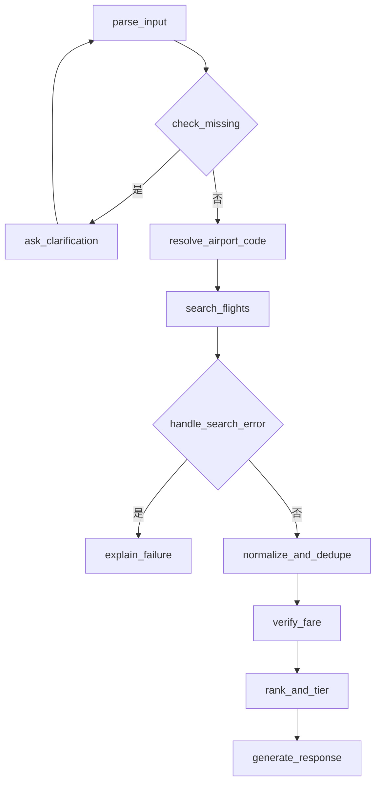

# 需求分析：机票比价 Agent（一天冲刺版）

本文档是本项目当前阶段的完整规格说明，写在动手编码之前，目的是让实现阶段可以直接对照，而不是边写边设计。范围已经从原始的 12 周学习计划（见 [../agent-learning-project-plan.md](../agent-learning-project-plan.md)）压缩为「已具备前置知识、一天内完成一个可讲清楚设计取舍的最小可展示版本」。

## 1. 背景与目标

- 背景：原计划是一个 12 周的系统学习 + 项目路线，覆盖结构化输出、工具调用、Agent 框架、MCP、评测与生产可靠性。
- 当前调整：前置知识已基本学过（不熟练但都接触过），不再按周程学习，改为一天内产出一个**范围明确、指标真实**的最小可展示项目，同时尽量在这一天内触达六个学习方向：API/结构化输出、Tool Calling、Agent Loop、LangGraph、MCP、Eval。
- 目标：
  1. 产出一个能跑通的机票比价 Agent（LangGraph 编排 + FastAPI 服务）。
  2. 用真实跑分（而非编造数字）支撑简历表述。
  3. 项目复杂度控制在一天可控范围内：单一 mock 数据源、10 节点图、10 场景评测集、最小 MCP 封装。

## 2. 范围定义

### 2.1 本次做（In Scope）

- 自然语言需求解析为结构化字段，缺失关键字段时追问。
- 基于 LangGraph 的多节点工作流（含条件分支、循环、错误处理分支）。
- 基于本地 mock 数据的航班搜索工具。
- 确定性的价格计算、币种/税费/行李标准化、去重、重新验价、排序分档。
- `search_flights` 等工具的 MCP-style schema 设计，并提供一个最小 MCP Server 封装（单工具）。
- FastAPI `/query` 接口 + Swagger UI。
- pytest 覆盖确定性逻辑。
- 10 场景固定评测集，测量 4 项真实指标。

### 2.2 本次不做（Out of Scope，写入 README Roadmap）

- 真实/沙箱机票 API 接入、多数据源并行搜索与部分失败容错（原计划 Stage 4）。
- 完整独立的 MCP Server 项目（细化多工具、完整测试与文档，原计划 Stage 5）。
- 用户偏好记忆 / RAG（原计划 Stage 6）。
- P95 响应时间、失败恢复成功率等需要更大样本量才有统计意义的指标。
- Web 前端 / Streamlit 演示页、在线部署。
- 多语言 i18n、认证鉴权、限流等生产级基础设施。

## 3. 目标用户场景

主场景（沿用原计划）：

> 查找 9 月从上海去东京、旅行 5 天、含 20kg 行李、避免红眼航班的综合最优机票。

其余场景由第 8 节的评测集覆盖（缺参数、模糊日期、错误机场代码、无结果、中途改需求等）。

## 4. 功能需求

对应架构图（见第 7 节）各节点：

| 编号 | 需求 | 对应节点 |
|---|---|---|
| F1 | 从自然语言中提取出发地、目的地、日期、行程天数、日期弹性、行李重量、是否避免红眼等字段 | `parse_input` |
| F2 | 缺失必要字段（出发地/目的地/日期三者之一）时不得猜测，必须追问 | `check_missing` / `ask_clarification` |
| F3 | 用户补充信息后能与已解析结果合并，重新进入解析流程 | `ask_clarification` → `parse_input` |
| F4 | 模糊城市名解析为机场代码；无法识别的机场代码需返回明确错误 | `resolve_airport_code` |
| F5 | 调用 `search_flights` 工具从 mock 数据中查询候选航班 | `search_flights` |
| F6 | 无结果或模拟工具异常时，返回清晰、可读的失败原因，而不是空结果或崩溃 | `handle_search_error` / `explain_failure` |
| F7 | 统一候选航班的币种、税费、行李费字段 | `normalize_and_dedupe` |
| F8 | 对同一行程的重复报价去重 | `normalize_and_dedupe` |
| F9 | 展示结果前重新验价（模拟“报价可能过期”场景） | `verify_fare` |
| F10 | 计算含行李费的总价，并输出最便宜 / 综合最优 / 最舒适三档结果 | `rank_and_tier` |
| F11 | 每条结果标注数据来源与查询时间 | `generate_response` |
| F12 | 用户中途修改条件（如临时更换目的地）时，Agent 能识别变化并重新处理，而不是叠加冲突条件 | `parse_input`（增量合并逻辑） |

## 5. 非功能需求

- **正确性优先于智能**：价格计算、排序、去重、币种换算一律由普通代码实现，不允许 LLM 生成或“估算”数字。
- **可观测**：每次请求记录耗时、Token 用量、是否命中追问分支、是否命中错误分支，供评测脚本统计。
- **可配置**：LLM Provider（`base_url` / `api_key` / `model`）必须可通过环境变量切换，不硬编码厂商 SDK 特有逻辑。
- **可测试**：确定性逻辑必须是无外部依赖的纯函数，便于 pytest 直接测试。
- **诚实**：所有对外指标（简历、README）必须来自评测脚本的真实输出，未测量的指标不得出现具体数字，只能写“待测量”或省略。

## 6. 数据模型

### 6.1 用户需求（Agent 内部状态的一部分）

```json
{
  "origin": "SHA",
  "destination": "TYO",
  "departure_date": null,
  "trip_duration_days": 5,
  "date_flexibility_days": 2,
  "checked_baggage_kg": 20,
  "avoid_red_eye": true,
  "missing_fields": ["departure_date"]
}
```

- 缺失字段用 `null`，并显式列在 `missing_fields` 中，禁止模型猜测填充。
- 城市名与机场代码需能互相映射（如 `上海` → `SHA`，覆盖多机场城市如 `SHA`/`PVG`）。

### 6.2 航班报价（mock 数据 / 工具返回）

```json
{
  "flight_id": "MU5042-2026-09-10",
  "origin": "SHA",
  "destination": "NRT",
  "departure_time": "2026-09-10T23:55:00+08:00",
  "arrival_time": "2026-09-11T04:10:00+09:00",
  "is_red_eye": true,
  "airline": "MU",
  "base_price": 1580,
  "currency": "CNY",
  "baggage_fee_per_20kg": 200,
  "tax_and_fees": 120,
  "source": "mock",
  "queried_at": "2026-09-13T10:00:00+08:00"
}
```

### 6.3 输出结果

```json
{
  "tier": "cheapest",
  "flight_id": "MU5042-2026-09-10",
  "total_price_cny": 1900,
  "breakdown": { "base_price": 1580, "baggage_fee": 200, "tax_and_fees": 120 },
  "source": "mock",
  "queried_at": "2026-09-13T10:00:00+08:00"
}
```

mock 数据集需要覆盖：至少两个目的城市（含多机场城市，如东京 NRT/HND）、正常航班与红眼航班、正常价格与无结果的日期区间、一个刻意设置的“无效机场代码”用例。

## 7. 系统架构与工作流（LangGraph）



节点职责与决策归属：

| 节点 | 职责 | LLM 还是普通代码 |
|---|---|---|
| `parse_input` | 自然语言 → 结构化需求（Pydantic 校验，失败重试） | LLM（结构化输出） |
| `check_missing` | 判断必要字段是否齐全 | 普通代码（条件边） |
| `ask_clarification` | 生成追问文案，合并用户新回答 | LLM 生成文案 + 代码合并状态 |
| `resolve_airport_code` | 城市名 → 机场代码，多机场消歧 | 普通代码（查表） |
| `search_flights` | 调用工具查询 mock 数据 | 工具调用（LLM 决定调用时机，代码执行） |
| `handle_search_error` | 判断是否无结果/模拟异常 | 普通代码（条件边） |
| `explain_failure` | 生成清晰的失败说明 | LLM 生成文案 |
| `normalize_and_dedupe` | 统一币种/税费/行李字段，去重 | 普通代码 |
| `verify_fare` | 重新验价（模拟报价过期判断） | 普通代码 |
| `rank_and_tier` | 计算总价、排序、分三档 | 普通代码 |
| `generate_response` | 组织最终自然语言 + 结构化结果 | LLM 生成文案 + 代码提供数据 |

这个划分本身是一个重要的面试讲解点：哪些环节必须让 LLM 做判断（理解自然语言、生成追问/解释文案），哪些环节绝不能让 LLM 参与（任何涉及金额、排序、去重的计算）。

## 8. MCP 兼容设计

- `search_flights`（以及后续 `resolve_airport_code`、`verify_fare`）的输入输出使用清晰的 JSON Schema 定义，字段带说明，错误返回结构化（`{"error_code": ..., "message": ...}`），这本身就是 MCP tool 的标准写法。
- 额外提供一个最小 MCP Server（`src/mcp_server.py`），仅暴露 `search_flights` 一个工具，用于验证「同一套工具函数，既能被内部 LangGraph 图直接调用，也能被外部 MCP 客户端调用」这一设计目标。
- 不追求完整独立项目标准（不单独写 MCP Server 的 README、测试矩阵），完整版本列入 Roadmap。

## 9. 技术栈

| 层级 | 选择 |
|---|---|
| 语言 | Python 3.11+ |
| Agent 编排 | LangGraph |
| LLM 接入 | OpenAI-compatible API，`base_url`/`api_key`/`model` 可配置 |
| 数据校验 | Pydantic |
| Web 服务 | FastAPI |
| 工具协议 | MCP-style schema + 最小 MCP Server |
| 测试 | pytest |
| 数据源 | 本地 mock JSON |

## 10. 项目结构

```text
flight-price-compare/
├── README.md
├── docs/
│   ├── requirements.md
│   └── resume-guide.md
├── src/
│   ├── app.py              # FastAPI 入口
│   ├── graph.py            # LangGraph 图定义
│   ├── nodes/               # 各节点实现
│   ├── tools/                # search_flights 等工具（MCP-style schema）
│   ├── mcp_server.py        # 最小 MCP Server 封装
│   ├── pricing.py           # 总价计算/排序/去重/验价（确定性逻辑）
│   └── models.py             # Pydantic 数据模型
├── tests/
│   └── test_pricing.py       # 确定性逻辑单元测试
├── data/
│   └── mock_flights.json
├── eval/
│   ├── scenarios.json        # 10 个评测场景
│   ├── run_eval.py           # 跑评测并输出指标
│   └── results.md             # 真实跑分记录（供 resume-guide 引用）
└── .env.example
```

## 11. 任务清单（有序，不锁死具体钟点）

1. 初始化依赖（LangGraph、FastAPI、Pydantic、pytest、OpenAI SDK 或等效 HTTP client）与 `.env.example`。
2. 定义 Pydantic 数据模型（第 6 节）。
3. 编写 `data/mock_flights.json`，覆盖评测集所需的全部场景（含无效机场代码、无结果日期区间、多机场城市）。
4. 实现 `pricing.py` 中的确定性逻辑：总价计算、币种/行李/税费标准化、去重、验价、排序分档，并配套 pytest。
5. 实现 `tools/search_flights.py`（及 `resolve_airport_code`），采用 MCP-style JSON Schema 定义输入输出与错误。
6. 用 LangGraph 搭建图（第 7 节的 10 个节点），先跑通主场景（正常单程、信息完整）。
7. 补齐追问循环、错误处理分支，跑通缺参数、无结果、错误机场代码等分支。
8. 实现 `src/mcp_server.py`，用一个 MCP 客户端（或简单脚本）验证 `search_flights` 可被外部调用。
9. 用 FastAPI 包一层 `/query` 端点，本地起服务，用 Swagger UI 手动跑一遍主场景。
10. 编写 `eval/scenarios.json`（10 个场景）与 `eval/run_eval.py`，跑一遍，把真实数字写入 `eval/results.md`。
11. 用真实数字回填 `docs/resume-guide.md` 中的指标占位符。
12. 回顾 README 与本文档，确保描述与实际实现一致（尤其是「快速开始」命令要能真的跑通）。

## 12. 验收标准

- [ ] 新用户能按 README 的「快速开始」在本地成功启动服务。
- [ ] 用户能通过一次自然语言请求完成一次机票查询（主场景）。
- [ ] 关键字段缺失时，Agent 会追问而不是猜测。
- [ ] 每条结果包含数据来源与查询时间。
- [ ] 工具无结果或模拟异常时，返回明确反馈而不是崩溃或空白结果。
- [ ] 价格计算、排序、去重逻辑有 pytest 覆盖且全部通过。
- [ ] 10 个评测场景可重复运行，4 项指标均为真实测量值。
- [ ] `search_flights` 可以被一个 MCP 客户端成功调用。
- [ ] 能在面试中解释：哪些环节用 LLM、哪些环节用普通代码，以及为什么这样划分。

## 13. 评测方案

### 13.1 固定场景（10 个）

| # | 场景 | 验证点 |
|---|---|---|
| 1 | 正常单程查询（信息完整） | 端到端一次成功返回三档结果 |
| 2 | 正常往返查询（信息完整） | 往返场景的解析与计算正确 |
| 3 | 缺出发地 | 触发追问，不猜测 |
| 4 | 缺目的地 | 触发追问，不猜测 |
| 5 | 缺日期 | 触发追问，不猜测 |
| 6 | 模糊/弹性日期（如“9月找便宜的机票”） | 正确解析为日期弹性区间 |
| 7 | 错误机场代码 | 返回结构化错误，不崩溃 |
| 8 | 无符合条件结果 | 走 `explain_failure` 分支，给出清晰说明 |
| 9 | 用户中途修改条件（如临时换目的地） | 正确合并新条件，不叠加冲突信息 |
| 10 | 特殊偏好组合（避免红眼 + 20kg 行李） | 总价计算与红眼过滤均正确 |

### 13.2 指标口径（4 项）

| 指标 | 定义 | 测量方法 |
|---|---|---|
| 参数提取正确率 | 10 个场景中，`parse_input` 输出的结构化字段与预期一致的比例 | `run_eval.py` 逐场景断言字段 |
| 工具调用成功率 | 需要调用 `search_flights` 的场景中，工具被正确调用且返回可用结果（或正确识别无结果）的比例 | 同上，检查工具调用日志 |
| 端到端任务完成率 | 10 个场景中，Agent 最终给出「符合预期的结果或符合预期的追问/错误说明」的比例 | 同上，对照场景预期结果 |
| 平均响应时间 + 平均 Token 成本 | 10 次请求的平均耗时（`time.perf_counter`）与平均 Token 用量（来自 LLM 响应的 usage 字段） | `run_eval.py` 汇总输出 |

评测结果写入 `eval/results.md`，格式建议：

```markdown
| 指标 | 数值 | 测量时间 |
|---|---|---|
| 参数提取正确率 | [N]% | 2026-xx-xx |
| 工具调用成功率 | [N]% | 2026-xx-xx |
| 端到端任务完成率 | [N]% | 2026-xx-xx |
| 平均响应时间 | [N]ms | 2026-xx-xx |
| 平均 Token 成本 | [N] tokens/请求 | 2026-xx-xx |
```

## 14. 已知限制

- 单一 mock 数据源，不覆盖多供应商并发失败、限流等场景。
- MCP 封装为最小可用版本，未按独立项目标准补全。
- 无用户偏好记忆，无持久化存储。
- 样本量（10 场景）不足以支撑 P95 等统计量，因此不纳入本轮指标。
- LLM Provider 的实际表现（幻觉率、延迟）会随所选模型不同而变化，`results.md` 需注明所用模型。

## 15. 后续计划（Roadmap，详见 README）

接入真实机票 API、完整 MCP 独立项目、用户偏好记忆、更完善的 Tracing 与更大规模评测、Web 前端与部署。
